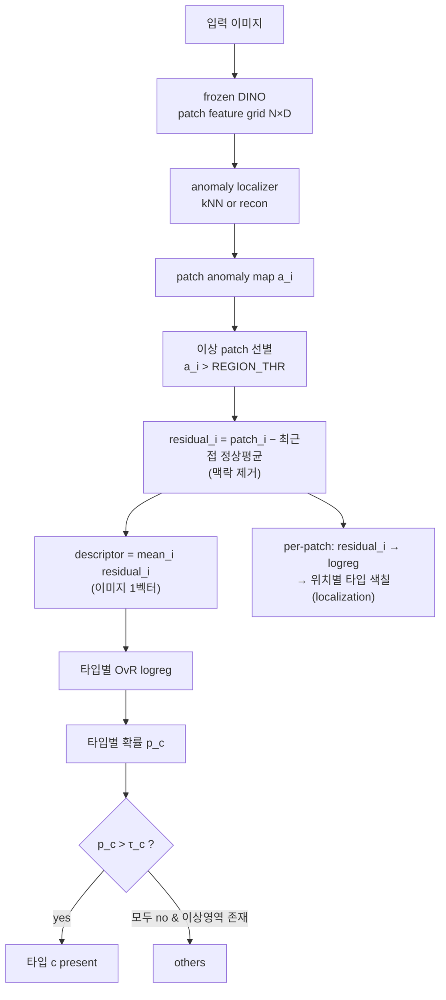

# Multi-label 불량 검출 알고리즘 (확정: P-log-res)

frozen DINO patch feature 위에서 **이미지 단위 multi-label 불량 종류 + others**를 약지도로 검출.
위치 라벨 없이, 불량이 여러 개 동시에 존재하는 상황을 처리한다.

- 검증: multi-label 노트북 `notebooks/multilabel_patch_defect.ipynb`
- 성적: **P-log-res mAP 0.922** ( > BG(전역) ~0.75(=맥락 shortcut) > P-cos(cosine memory, 최저) )
- 결론: **종류 신호는 "국소 + 맥락제거(residual) feature"에 실재**하고, **판별 헤드(OvR logreg)** 로 뽑는다.

---

## 핵심 아이디어 (왜 이렇게)

| 선택 | 이유 |
|---|---|
| **patch(국소)** | 불량은 공간적으로 국소·다중. 전역 pooling 은 co-occurrence 를 엉키고 **배경 맥락 shortcut** 을 탐. |
| **residual(맥락제거)** | 원본 patch feature 엔 배경·취득조건이 섞임 → `원본 − 최근접 정상`으로 **결함 방향만** 남김. |
| **OvR logreg(판별)** | cosine memory 매칭은 약함(실험 최저). 타입별 독립 이진 분류 → **multi-label 네이티브**. |
| **anomaly 게이트** | 정상만으로 무감독 학습 → "어디가 이상한가"를 라벨 없이 선별. |

---

## 파이프라인



---

## A. 학습 (오프라인 / 관리자)

입력: 이미지별 **multi-label 집합**(폴더명 = 타입, `normal/`, `classA/`, `classA+classB/`) + 정상 세트.

1. **feature**: 각 이미지 → frozen DINO patch grid `[N, D]`, L2 정규화. (해상도 `img_size` 조절 → `N=(img_size/16)²`)
2. **정상 메모리** `M` = 정상 이미지 patch 들의 **coreset**(greedy K-center, `CORESET`).
3. **anomaly localizer**:
   - `kNN`(기본): `a_i = 1 − (M 과의 top-k cosine 평균)`
   - `recon`(옵션): 정상 feature 재구성 transformer(Dinomaly-lite), `a_i = 1 − cosine(재구성, 원본)`
4. **REGION_THR** = 정상 patch anomaly 분포의 `REGION_PCT`(예 99) 퍼센타일. → 이상 patch 기준(절대 임계, 이미지당 quota 없음).
5. **descriptor(이미지 1개)**:
   - 이상 patch = `a_i > REGION_THR` (없으면 최이상 top-K 폴백)
   - `residual_i = L2( patch_i − mean(patch_i 의 k-최근접 M) )`  ← **맥락 제거**
   - `descriptor = L2( mean_i residual_i )`
6. **타입별 헤드**: 각 타입 c 에 대해 **One-vs-Rest LogisticRegression** 을 `(descriptor, y_c)` 로 학습
   (`y_c = 1 if c ∈ 이미지 라벨`, `class_weight="balanced"`). multi-label 이미지는 여러 c 에 동시 양성.
   - per-patch 색칠/localization 용으로 동일 헤드를 **각 residual patch 에 적용** 가능.

> 학습되는 것은 **타입별 logreg 뿐**. 백본·localizer(kNN)·임계는 학습 아님(정상으로 보정).

---

## B. 추론 (이미지당)

1. patch feature → `a_i`(anomaly) → 이상 patch 선별.
2. `descriptor` = 이상 residual 평균.
3. 타입별 logreg 확률 `p_c`.
4. **present 타입 집합** = `{ c : p_c > τ_c }`  → **multi-label 출력**.
5. **others**: 이상 영역은 있는데 **어떤 타입도 present 아님**(모든 `p_c ≤ τ_c`) → others.
6. **localization**(옵션): 각 이상 patch 의 residual 에 logreg → 위치별 타입 색칠(육안/근거 제시).

---

## Localizer 상세 (kNN vs recon)

anomaly map `a_i`(어디가 이상한가)를 만드는 두 방식. **typing residual 은 항상 kNN 최근접 정상 기준**이며,
localizer 는 "이상 patch 선별(REGION_THR 게이트)"에만 영향.

### kNN (기본, 무학습)
- 정상 coreset `M` 과의 `a_i = 1 − (top-k cosine 평균)`.
- 장점: 학습 불필요, 안정, 빠름. residual 참조(최근접 정상)와 메커니즘 공유.
- 단점: coreset 구성에 민감하고, 관찰상 **결함이 아닌 맥락 유사 영역에 반응**하기도 함(localization 품질 낮음).

### recon (옵션, Dinomaly-lite, torch)
정상 feature 를 **재구성**하도록 얕은 transformer 를 정상만으로 학습 → 재구성 잔차를 이상도로 사용.

**구조**
```
patch feature [N,D]
  → Linear(D→m)
  → (학습 시) noisy bottleneck: z += 𝒩(0,σ)          # identity-shortcut 방지
  → TransformerEncoder(spatial self-attention, L층)   # 토큰(패치) 간 문맥 참조
  → Linear(m→D) → L2
  = 재구성 r_i
```
- **spatial self-attention**: "주변 패치로 보아 이 자리엔 어떤 정상 feature 가 와야 하나"를 학습 → 문맥 기반.
- **noisy bottleneck**: 병목에 노이즈를 주입해 디코더가 입력을 그대로 복사(이상까지 복원)하는 것을 억제.

**학습** (정상 이미지만)
- 이미지별 토큰집합 `[N,D]` 배치, 손실 `= 1 − cosine(r_i, x_i)` 평균.
- **hard-mining**(`RECON_HARDQ<1`): 고손실(어려운) 정상 토큰만 평균 → 정상 재구성 baseline 을 낮춰 잔차 대비를 선명하게.

**추론**
- `a_i = 1 − cosine(r_i, x_i)`. 정상은 잘 복원돼 낮고, 이상은 복원 실패로 높음.

**특성**
- 장점: 관찰상 **결함 위치를 정확히** 잡음(공간 문맥). coreset 크기 민감성 없음.
- 단점: 학습 필요(torch/GPU). 이미지레벨 탐지점수(top-p% 등)는 **정상 대비 보정 없으면 노이즈**
  (재구성 어려운 정상 패치도 잔차↑) → 단일라벨 실험에서 이미지레벨 det AUROC 가 kNN 보다 낮게 나오기도 함.
  단, **typing 에는 위치가 중요**하므로 이 이미지레벨 탐지 약점과는 별개.

**개선 로드맵**
1. **multi-layer 재구성** — 여러 DINO layer(저/고수준)를 함께 재구성(= Dinomaly 최대 레버). **서비스가 다층 patch 반환** 필요.
2. **linear / unstable attention** — identity-shortcut 추가 억제.
3. **per-patch 정상 대비 잔차 정규화** — 정상 잔차 분포로 표준화 → 이미지레벨 탐지 개선.
4. **recon 잔차를 typing residual 로도 사용** — 재구성 `r_i` 는 "그 패치의 기대 정상값"이라 `x_i − r_i` 를
   맥락제거 residual 로 쓸 수 있음(현재는 kNN 최근접 정상 사용). 문맥 기반이라 더 깨끗할 여지.

관련 파라미터: `RECON_M`(bottleneck), `RECON_LAYERS`, `RECON_EPOCHS`, `RECON_NOISE`(σ), `RECON_HARDQ`.

---

## 파라미터

| 이름 | 역할 | 기본 |
|---|---|---|
| `IMG_SIZE` | 입력 해상도(patch 격자 = /16). 미세 결함이면 ↑ | 서버 기본(448) |
| `LOCALIZER` | `knn` \| `recon`(transformer) | knn |
| `K_NN` | anomaly / residual 최근접 수 | 3 |
| `CORESET` | 정상 메모리 크기 | 4000 |
| `REGION_PCT` | 이상 patch 임계(정상 분포 퍼센타일) | 99 |
| `τ_c` / `OTHERS_P` | 타입 present / others 임계 | **보정 필요** |

---

## 현황 & 남은 것

- ✅ **종류 신호가 국소-residual 에 실재**(shortcut 아님) 확정. P-log-res mAP **0.922**.
- ⬜ **operating point 보정**: `τ_c`(타입별 present) / `OTHERS_P` — AP 는 threshold-free 라, 제품엔 임계 필요.
- ⬜ **per-patch 헤드**: 현재 헤드는 pooled descriptor 로 학습 → 단일 patch 적용 시 약한 분포이동.
  단일라벨 이미지의 이상 patch 로 **patch 직접 학습**하면 위치별 판정이 더 선명(others 아티팩트 감소).
- ⬜ **절대성능 여지**: BG 조차 ~0.75 → 데이터 충원, feature(multi-layer 재구성·해상도) 개선.
- ⬜ **타입 성질**: pitting=국소 뜯김/흠집, partial=넓은 부분 불일치(전역). 필요 시 타입별 전략 분리.
- ➡️ 다음: `emclf_ui` 를 (국소 residual + OvR logreg + per-patch multi-label + others임계) 로 재설계.
